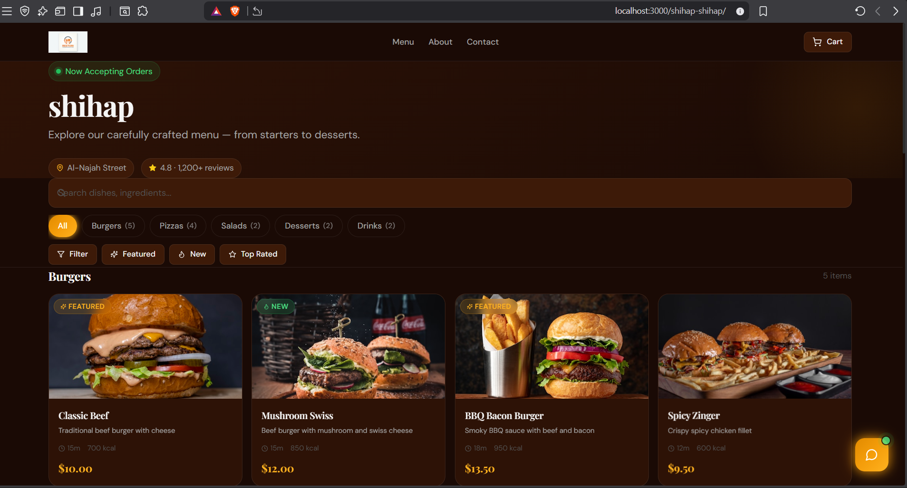
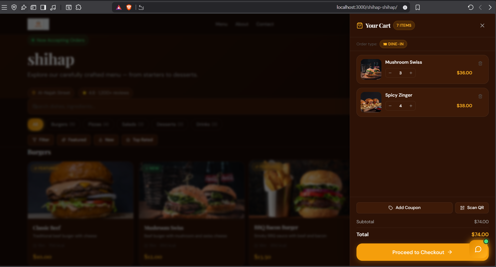
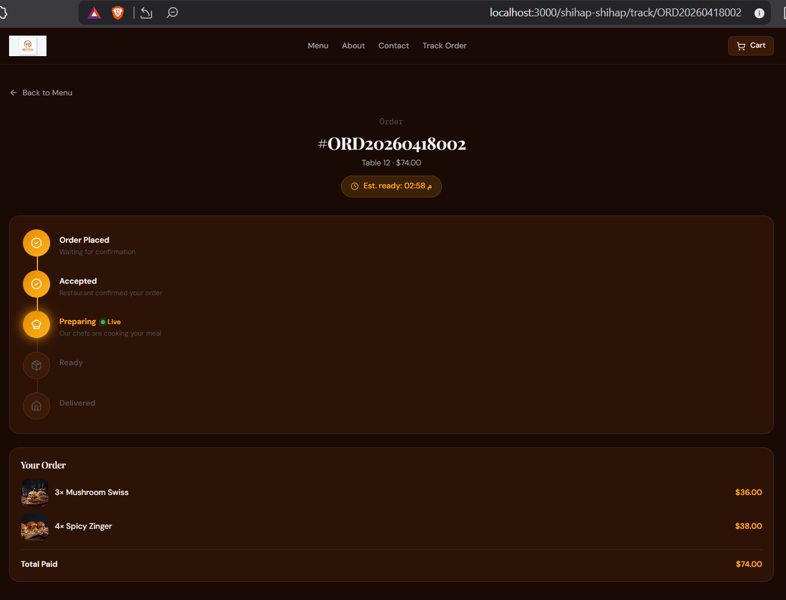
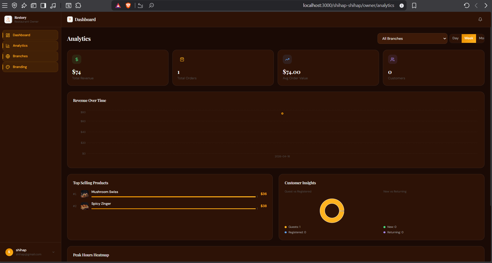

> Increase throughput, reduce wait times, and grow revenue across every location.

# Restaurant SaaS System — Enterprise operations for multi-branch restaurants 🚀

Centralized order management, branch-scoped carts, and real-time fulfillment for restaurant groups.

## Overview

Restaurant SaaS System helps multi-location restaurants operate consistently and efficiently. Branch-scoped ordering prevents fulfillment errors; real-time updates and dashboards reduce delays and surface revenue-driving insights.

## Key Features

- Multi-branch management with centralized menus and per-branch reporting.
  > 🔁 Increase throughput, reduce wait times, and grow revenue across every location.

# Restaurant SaaS System — Enterprise operations for multi-branch restaurants 🚀


Centralized order management, branch-scoped carts, and live fulfillment for restaurant groups.

## Overview

Restaurant SaaS System is a production-grade SaaS platform that centralizes menus, branch operations, and order routing while enforcing branch-scoped ordering and real-time fulfillment. The platform reduces fulfillment errors, shortens wait times, and surfaces actionable KPIs for managers.

## Problem 🚨
- 🍽️ Multi-branch restaurants suffer from order mismatches between branches  
- ⏱️ Slow and inconsistent order fulfillment across locations  
- 📉 Lack of unified analytics and operational visibility  
- ❌ Human errors when orders are not scoped per branch  

## Solution 💡
- 🧠 A centralized SaaS system that enforces **branch-scoped ordering**
- ⚡ Real-time order tracking and fulfillment using WebSockets  
- 📊 Unified dashboards for revenue, performance, and analytics  
- 🔒 Strict data isolation per branch (`branch_id`) to prevent mistakes  
- 🛒 Persistent cart system to reduce order abandonment  

## Key Features

### Business features

- 📊 Multi-branch management with per-branch branding and pricing.
- 🛒 Branch-scoped cart & checkout to eliminate cross-location fulfillment issues.
- 🔐 Role-based access (Admin / Owner / Manager / Staff / Customer).
- 📈 Operational dashboards: revenue, peak hours, product performance, coupon impact.
- ♻️ Persistent carts and optimistic checkout UX to reduce abandonment.

### Technical features

- ⚡ Real-time order lifecycle (new → preparing → ready → completed) via WebSockets.
- 🔁 Transactional order creation with idempotency to prevent duplicates.
- 🧭 Branch-level data isolation (`branch_id`) enforced at API and DB layers.
- 🧰 Background workers for notifications, reconciliation, and reporting.
- 🔌 Well-defined integration points for payments, delivery, and analytics.

## Tech Stack

- **Frontend:** React (TypeScript), Vite, Tailwind CSS, Zustand, TanStack Query.
- **Backend:** PHP , REST API, Queue workers.
- **Data & real-time:** MySQL (source of truth), Redis (cache + pub/sub),  WebSockets.
- **DevOps & Observability:**  Supervisor, GitHub Actions, Sentry, Prometheus/Grafana.
- **Testing:** PHPUnit (backend), Cypress (E2E).

## Architecture

### High-level design

- SPA frontend issues REST commands and subscribes to WebSocket channels for live updates.
- API  validates requests, persists to MySQL, then publishes domain events to Redis.
- WebSocket layer relays events to subscribed clients; workers perform async processing.

### Multi-branch concept

- All operational models (product, order, coupon, stock) include `branch_id`.
- Frontend scopes requests to the selected branch and keys persisted carts by `branch_id`.
- Backend enforces branch ownership with middleware, validation, and DB constraints.

### Order flow (summary)

1. 🧾 Customer selects a branch and builds a local cart (persisted by `branch_id`).
2. 🔒 Client submits `POST /api/v1/orders` with an idempotency key.
3. ✅ Backend validates, snapshots product data, and creates order+items in a DB transaction.
4. 📣 After commit the backend emits events to `branch.{id}` and `order.{num}`.
5. 👩‍🍳 Staff on `branch.{id}` and customer on `order.{num}` receive live updates.

### Real-time considerations

- Publish events only after transaction commit to avoid race conditions.
- Treat WebSockets as an experience layer; authoritative state is in MySQL and recovered via REST on reconnect.
- Scale using multiple WebSocket nodes bridged by Redis pub/sub or outsource to a managed provider.

## Screenshots

  
_Dashboard: KPIs and revenue charts._

  
_Branch-specific menu and branding preview._

  
_Branch-scoped cart with session persistence._

  
_Live order tracking and status updates._

## Installation (quick)

Prereqs: Node 18+, PHP 8.1+, Composer, MySQL 8+, Redis, Docker (recommended)

```bash
git clone <REPO_URL>
cd <PROJECT_DIR>

# Backend
cd backend      # or backend-ree
composer install
cp .env.example .env   # set DB_*, REDIS_*, BROADCAST_DRIVER, APP_URL
php artisan key:generate
php artisan migrate --seed
php artisan storage:link
php artisan serve --port=8000

# WebSockets (separate terminal)
php artisan websockets:serve --port=6001

# Frontend
cd ../frontend
npm install
cp .env.example .env   # set VITE_API_URL
npm run dev
```

Production notes: build frontend (`npm run build`), use `composer install --no-dev`, cache config/routes, and run workers and WebSocket processes under Supervisor/systemd.

## Usage flows

- **Admin:** create restaurants & branches, manage menus, coupons, staff, and view consolidated KPIs.
- **Staff:** monitor branch queue in real time, update order statuses, manage fulfillment.
- **Customer:** choose branch (or scan QR), build a cart (persisted per-branch), checkout, and follow live tracking.

## Project structure (summary)

- `frontend/` — React SPA (pages, components, hooks, assets).
- `backend/` or `backend-ree/` — Laravel API (controllers, services, events, workers).
- `database/` — schema and seed scripts.
- `config/` — application configuration.
- `uploads/` — media assets.
- `restaurant-saas/screenshots/` — README images (placeholders).

## Future roadmap (enterprise)

- PCI-compliant payments and subscription billing.
- Multi-tenant onboarding and white-labeling.
- Sharded inventory / per-branch partitions for extreme scale.
- Advanced analytics: LTV, cohorts, automated reporting.
- Canary deploys, distributed tracing, and auto-remediation.

## Author

Shihap Gaper — Full Stack Developer building SaaS and real-time systems that improve operational efficiency and revenue.  
Portfolio: https://shihap-gaper-portfolio-fajj.vercel.app/ • GitHub: https://github.com/shihap12 • LinkedIn: https://www.linkedin.com/in/shihap-gaper-b490b4382/

---

For deployment templates, CI/CD examples, or a production `docker-compose.yml`, contact the maintainer via the links above.
